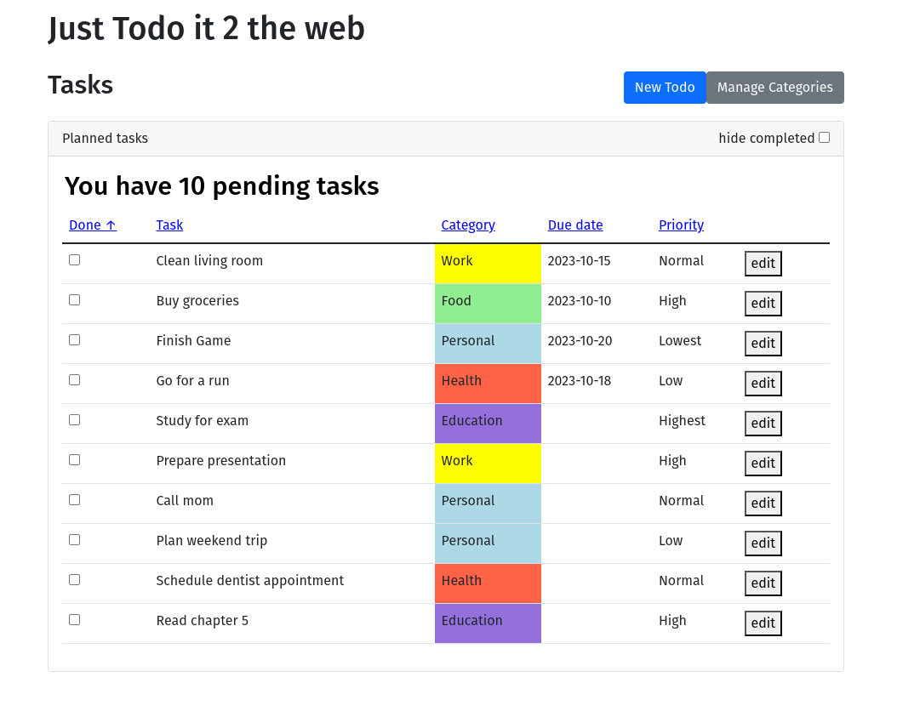
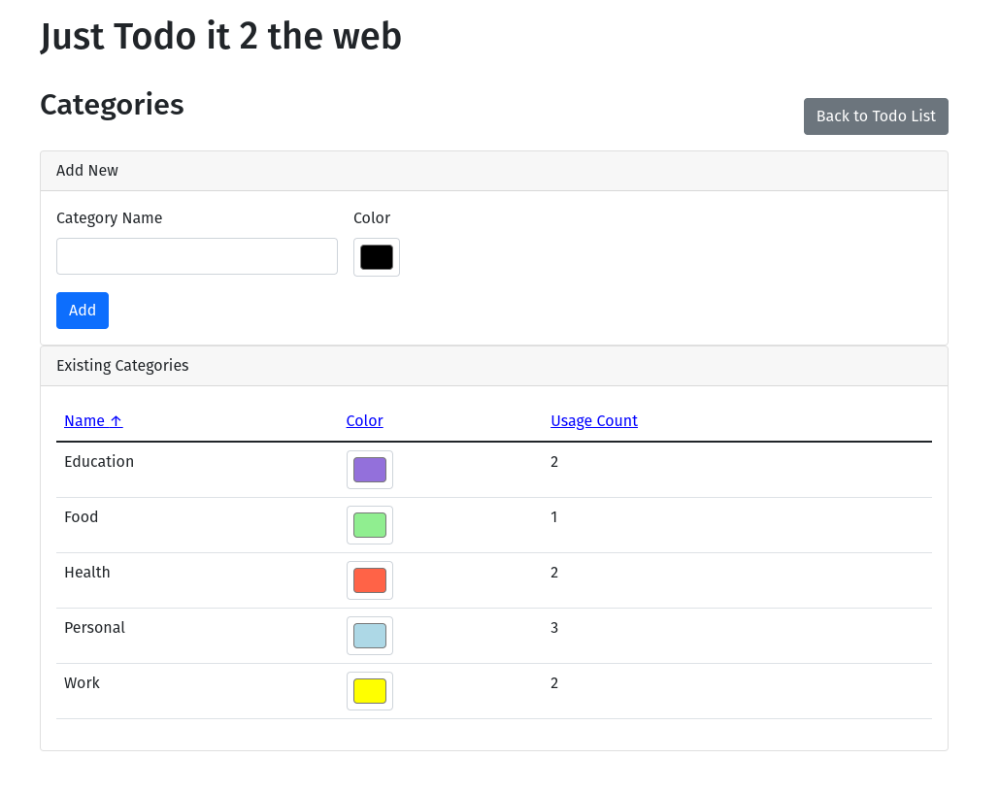
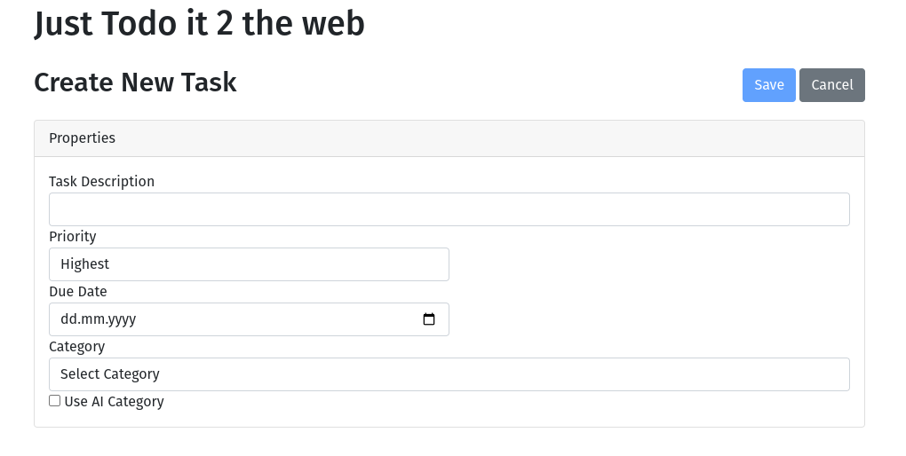

Todo app i did for a school project
Uses Postgres to store and retrieve tasks and Open AI API for automatically generating Categories based on the tasks provided.
This app needs a postgres server running and a database already setup to be able to run. Default name of database: todos. 
The Name can be changed in 'application.properties'. 

setting up app:
- clone repo
- place .env file in root containing postgres information and OpenAI Api key
- setup configuration in application.properties if needed (enable dev profile if test data should be created)
- compile and run app with maven

go to localhost:8080/todos/list to see the app

## Screenshots

*Main todo list view with sorting and filtering options*

 
*Form for managing categories*

*Form for adding new or edit an existing todo item*

